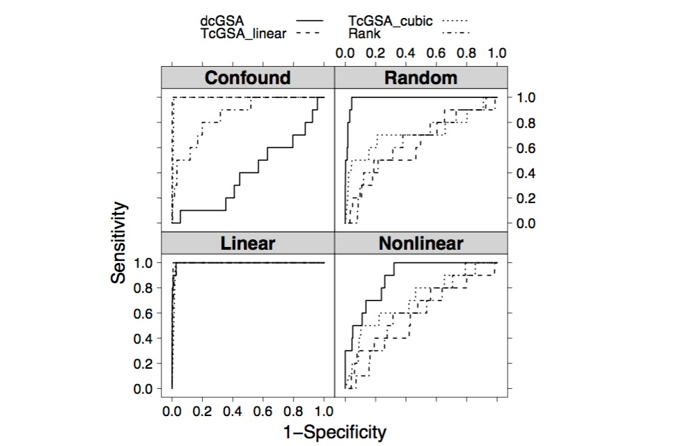
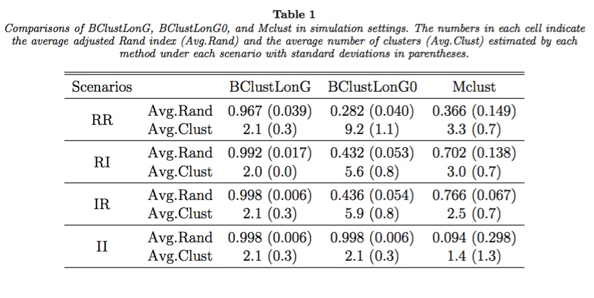

<!-- Banner -->
<section id="banner">
	

		<h2>{{ site.title }}</h2>
		
{{ site.description | markdownify }}

	

	<a href="#one" class="more scrolly">Know Me More</a>
</section>

<!-- One -->
<section id="one" class="wrapper style2 special">
	

		<header class="major">
			<h3>Personal Information</h3>
			
I am a 5th-year PhD student at <a href="https://publichealth.yale.edu/biostat/">Yale Biostatistics Department</a>.
			My advisor is <a href="http://zhaocenter.org">Dr. Hongyu Zhao</a>.
			My research interests are to develop statistical methods for biomarker discovery, risk prediction, and subgroup identification in longitudinal genomics studies with the primary goal to better understand the disease and translate genomics data into clinical applications for improved prevention strategies, diagnostic tools, and/or treatment protocols. 

			<h4>Education</h4>
			 
			<li> 2012-present Ph.D. in Biostatistics, Yale University (Expected Graduation: May 2017)  </li>
			<li> 2010-2012 ScM. in Biostatistics, Johns Hopkins Bloomberg School of Public Health   </li>
			<li> 2006-2010 B.E. in Bioinformatics, Huazhong University of Science and Technology  </li>
             
			<h4>Selected Honors and Awards</h4>
			 
			<li> Conference Travel Fellowship Award, Yale Graduate Student Assembly, 2016  </li>
			<li> Top 10 candidates nominated by Yale University for HHMI International Student Research Fellowships, 2015  </li>
			<li> Kocherlakota Award from the Department of Biostatistics at Johns Hopkins Bloomberg School of Public Health, 2011  </li>

		</header>
		<!-- <ul class="icons major">
			<li><a id="test1" href="#three" title='Research Spotlight'></a></li>
			<li><a id="test2" href="/interest.html" title='Interest'></a></li>
			<li><a id="test3" href="/Links.html" title='Links'></a></li>
		</ul> -->
	

</section>

<!-- Two -->
<!-- <section id="twoplus" class="wrapper style2 special">
	

		<header class="major">
			<h2 align="center"><i>Resesarch Spotlight</i></h2>
			
 

		</header>
	

</section>

  <section id="two" class="wrapper alt style2">
    <section class="spotlight">
      

      

        <h2>Classification of high-dimensional gene expression data</h2>
        
By assuming the covariance matrix to be block-diagonal and sparse, Sparse Quadratic Discriminant Analysis (SQDA) considers the genetic network rewiring sample classification of high-dimensional gene expression profiles.   <i>The left figure decribes the general workflow of SQDA based on a toy example of classifications of tumor and normal samples.</i>

      

    </section>
    <section class="spotlight">
      

      

        <h2>Gene set analysis on longitudinal expression profiles</h2>
        
Distance-correlation based Gene Set Analysis (dcGSA) is proposed to assess the associations between gene sets and outcomes with the consideration of both expression profiles and clinical outcomes' longitudinal nature.   <i>The right figure shows the ROC curves comparing four gene set analysis methods under different simulation scenarios.</i>

      

    </section>
    <section class="spotlight">
      

      

        <h2>Subtype Identification on longitudinal expression profiles</h2>
        
By modeling the expression trajectory over time in a linear mixed-effects framework and clustering based on the regression coefficients, BClustLonG accounts for the gene-gene correlation and tackles the high dimensionality challenge in a unique and innovative way.   <i>The left table demonstrates the performance of BClustLonG under different simulation scenarios. </i>

      

    </section>
  </section> -->

<!-- Three -->
  <section id="three" class="wrapper style2 special">
    

      <header class="major">
        <h2>Publication and Software</h2>
        <ol align="left" reversed="true">

*: Equal Contribution

<li> <strong>Jiehuan Sun</strong>, Tianqi Liu, Jose D. Herazo-Maya, Kuang-Yao Lee, Naftali Kaminski, and Hongyu Zhao. "Sure independence feature screening for longitudinal biomarkers and a survival outcome." <i>Manuscript</i>.   </li>
<li> Molei Liu*, <strong>Jiehuan Sun*</strong>, Jose D. Herazo-Maya, Naftali Kaminski, and Hongyu Zhao. "Joint models
for time-to-event data and longitudinal biomarkers of high dimension. " <i>Manuscript</i>.    </li>
<li> Jose D. Herazo-Maya*, <strong>Jiehuan Sun*</strong>, Philip Molyneaux, Julian Villalba-Nunez, Argyrios Tzouvelekis, Qin Li, Heather Lynn, Brenda M. Juan-Guardela, Xiting Yan, George Michel, Nachelle Aurelien, Kathleen O. Lindell, Melinda J. Klesen, Yingze Zhang, Hongyu Zhao, Joe GN Garcia, Imre Noth, Antje Prasse, Ziv Bar-Joseph, Kevin F. Gibson, Erica Herzog, Ivan O. Rosas, Toby Maher, and Naftali Kaminski. "A 52-gene signature in peripheral blood identifies a genomic profile associated with increased risk of mortality and poor disease outcomes in Idiopathic Pulmonary Fibrosis." <i>Under review at The Journal of the American Medical Association</i>.    </li>
<li> <strong>Jiehuan Sun</strong>, Jose D. Herazo-Maya, Naftali Kaminski, Hongyu Zhao, and Joshua L. Warren. "A Dirichlet process mixture model for clustering longitudinal gene expression data." <i>Under review at Journal of the Royal Statistical Society: Series C</i>.    </li>
<li> <strong>Jiehuan Sun</strong>, Jose D. Herazo-Maya, Xiu Huang, Naftali Kaminski, and Hongyu Zhao. "Distance-correlation based gene set analysis in longitudinal studies." <i>Under revision at Annals of Applied Statistics</i>.    </li>
<li> <strong>Jiehuan Sun</strong>, Joshua L. Warren, and Hongyu Zhao. "A Bayesian semiparametric factor analysis model for subtype identification." <i>Under revision at Statistical Applications in Genetics and Molecular Biology</i>.    </li>
<li> Qiongshi Lu, Chentian Jin, <strong>Jiehuan Sun</strong>, Russell Bowler, Katerina Kechris, Naftali Kaminski, and Hongyu Zhao. "Post-GWAS prioritization through data integration provides novel insights on chronic obstructive pulmonary disease." <i>Statistics in Biosciences</i>, in press. [<a target="_blank" href="http://link.springer.com/article/10.1007/s12561-016-9151-2">Link</a>]  </li>
<li> Qiongshi Lu, Yiming Hu, <strong>Jiehuan Sun</strong>, Yuwei Cheng, Kei-Hoi Cheung, and Hongyu Zhao. ”A statistical framework to predict functional non-coding regions in the human genome through integrated analysis of diverse types of annotation data.” <i>Scientific reports</i> 5 (2015): 10576. [<a target="_blank" href="http://www.nature.com/articles/srep10576">Link</a>]   </li>
<li> <strong>Jiehuan Sun</strong> and Hongyu Zhao. ”The application of sparse estimation of covariance matrix to quadratic discriminant analysis.” <i>BMC bioinformatics</i> 16, no. 1 (2015): 48. [<a target="_blank" href="http://bmcbioinformatics.biomedcentral.com/articles/10.1186/s12859-014-0443-6">Link</a>]  </li>
<li> <strong>Jiehuan Sun</strong>, Xintao Hu, Xiu Huang, Yang Liu, Kaiming Li, Xiang Li, Junwei Han, Lei Guo, Tianming Liu, and Jing Zhang. ”Inferring consistent functional interaction patterns from natural stimulus FMRI data.” <i>NeuroImage</i> 61, no. 4 (2012): 987-999. [<a target="_blank" href="http://www.sciencedirect.com/science/article/pii/S1053811912002868">Link</a>]  </li>
<li> Jian Yu, Xiaobin Xing, Lingyao Zeng, <strong>Jiehuan Sun</strong>, Wei Li, Han Sun, Ying He Jing Li, Guoqing Zhang, Chuan Wang, Yixue Li, and Lu Xie. ”SyStem-Cell: a database populated with multiple levels of experimental data from stem cell differentiation research.” <i>PLoS ONE</i> 7, no. 7 (2012): e35230. [<a target="_blank" href="http://journals.plos.org/plosone/article?id=10.1371/journal.pone.0035230">Link</a>]  </li>

				</ol>
      </header>
      <ul class="features">
        <li class="icon fa-laptop">
          <h3>sQDA</h3>
          
R package to perform Sparse Quadratic Discriminant Analysis (SQDA) with the assumption of block-diagonal and sparse covariance matrix. SQDA is useful in classification of high-dimensional gene expression data, with the consideration of the genetic network rewiring in sample grouping subclasses. [<a target="_blank" href="https://cran.r-project.org/web/packages/SQDA/index.html"><b>CRAN</b></a>] 

        </li>
        <li class="icon fa-heart-o">
          <h3>dcGSA</h3>
          
R package to perform distance-correlation based Gene Set Analysis (dcGSA) for longitudinal gene expression profiles. The dcGSA package is useful to assess the associations between gene sets and outcomes, considering both expression profiles and clinical outcomes' longitudinal nature. [<a target="_blank" href="https://bioconductor.org/packages/devel/bioc/html/dcGSA.html"><b>Bioconductor</b></a>]

        </li>
        <!-- <li class="icon fa-flag-o">
          <h3>GENOCANYON</h3>
          
Whole-genome functional annotation approach based on unsupervised statistical learning. It integrates genomic conservation measures and biochemical annotation data to predict the functional potential at each nucleotide. [<a target="_blank" href="http://genocanyon.med.yale.edu"><b>Website</b></a>]

        </li> -->
      </ul>

    

  </section>

<section id="four" class="wrapper style2 special">
  

	<header class="major">
		<h2>Conferences</h2>
		 
		<h4>Presentations</h4>
		<ul align="left">
         <li> "A Dirichlet Process Mixture Model for Clustering Longitudinal Gene Expression Data", <i>Joint Statistical Meetings (JSM)</i>, July 30 - August 4, 2016. </li>
		<li> <strong>(Invited)</strong> "Discovery of Novel Loci Associated with COPD by Pooling Information from Related Clinical Feature and Functional Annotation", <i>Eastern North American Region (ENAR) Spring Meeting</i>, March 6-9, 2016. </li>
		<li>“Discovery of Novel Loci Associated with COPD by Pooling Information from Related Clinical Feature and Functional Annotation”, <i>Bioinformatics Transition Workshop - SAMSI</i>, May 11-13, 2015.</li>
		<li>“The application of sparse estimation of covariance matrix to quadratic discriminant analysis”, <i>The 29th New England Statistics Symposium</i>, April 24-25, 2015.</li>
        <li>“Discovery of Novel Loci Associated with COPD by Pooling Information from Case-control status, Related Clinical Feature, and Functional Annotation”, <i>Statistical and Computational Challeges in Omics Data Integration workshop - SAMSI</i>, February 16-17, 2015.</li>

		</ul>
		<h4>Posters and Workshops</h4>
		<ul align="left">
		<li><i>The 30th New England Statistics Symposium</i>, April 21-22, 2016. </li>
        <li><i>2014 Rutgers Statistics Symposium Statistics and the Century of Data</i>, May 2, 2014.</li>
		<li><i>Statistical Methods for Very Large Datasets Conference</i>, June 1-3, 2011.</li>
		<li><i>The 9th China-Japan-Korea Bioinformatics Training Course and Bioinformatics Symposium</i>, April 20-23, 2010. </li>

		</ul>
	</header>
	

</section>

<!-- CTA -->
<section id="cta" class="wrapper style2">
	

		<header>
			<h2>Contact</h2>
			
Address: 60 College Street, New Haven CT 06520  
			Email: jiehuan DOT sun AT yale DOT edu

		  <ul class="icons">
			
			
			
			<li><a target="_blank" href="{{ socloc[1] }}" class="icon fa-envelope-o"
				   >E-mail</a></li>
			
			
			<li><a target="_blank" href="{{ socloc[1] }}" class="ai ai-google-scholar-square ai-1.1x"
				   ></a></li>
			
			<li><a target="_blank" href="{{ socloc[1] }}" class="icon fa-{{ socloc[0] }}"
				   >{{ socloc[0] }}</a></li>
			
			
			
			
		  </ul>
		</header>
		<ul class="actions">
			<li><a target="_blank" href="/assets/CV Jiehuan Sun.pdf" class="button special">Curriculum Vitae</a></li>
		</ul>
	

</section>
